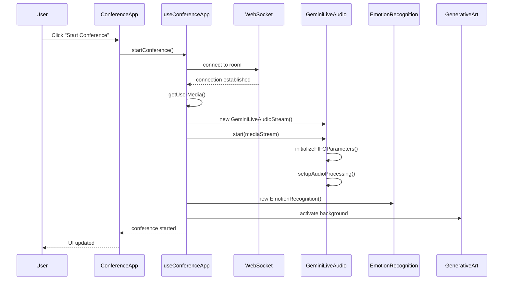
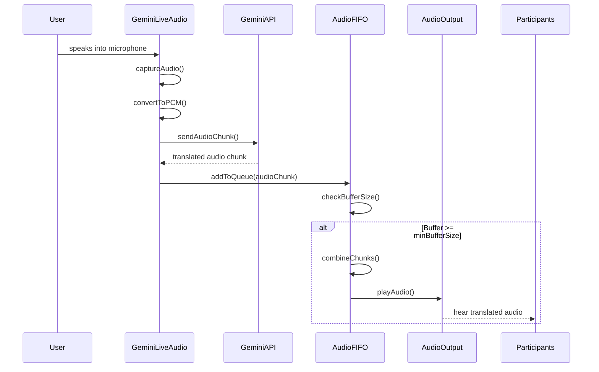
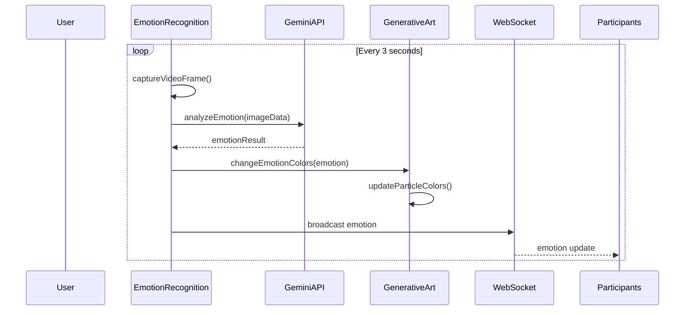
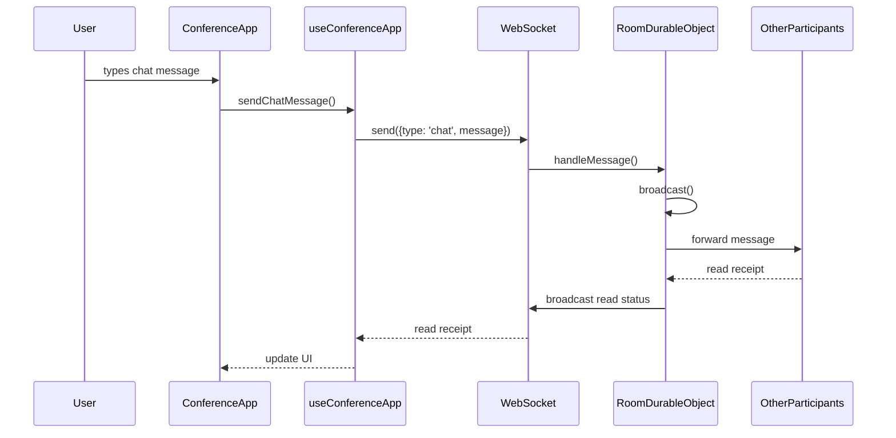

# otak-conference アーキテクチャ図とシーケンス図

## クラス図

```mermaid
classDiagram
    %% Frontend Core Classes
    class ConferenceApp {
        +render() React.Element
        +handleUserInteraction()
        +displayParticipants()
        +showTranslations()
    }
    
    class useConferenceApp {
        +useState() hooks
        +useEffect() hooks
        +WebSocket management
        +WebRTC management
        +Audio processing
        +Emotion recognition
    }
    
    %% Audio Processing Classes
    class GeminiLiveAudioStream {
        -genAI: GoogleGenAI
        -session: Session
        -audioFIFOQueue: string[]
        -isStreamingActive: boolean
        +constructor(config)
        +start(stream: MediaStream)
        +stop()
        +sendAudio(data: Float32Array)
        -initializeFIFOParameters()
        -processAudioChunk()
        -combineAndPlayAudio()
    }
    
    class GeminiAudioProcessor {
        -genAI: GoogleGenAI
        -mediaRecorder: MediaRecorder
        -audioChunks: Blob[]
        -detectedGender: string
        +constructor(config)
        +start(stream: MediaStream)
        +stop()
        +detectGender(name: string)
        -processAudioChunks()
    }
    
    class EmotionRecognition {
        -genAI: GoogleGenAI
        -isAnalyzing: boolean
        -lastAnalysisTime: number
        +constructor(apiKey: string)
        +analyzeEmotion(video: HTMLVideoElement)
        +setTokenUsageCallback()
        -captureImageFromVideo()
    }
    
    %% Background and Visual Effects
    class GenerativeArtBackgroundWebGL {
        -canvas: HTMLCanvasElement
        -gl: WebGLRenderingContext
        -particles: Particle[]
        -perlinNoise: PerlinNoise
        +constructor(props)
        +render()
        +updateParticles()
        +changeEmotionColors(emotion: string)
        -initWebGL()
        -createShaders()
    }
    
    class PerlinNoise {
        -permutation: number[]
        -p: number[]
        +constructor()
        +noise(x: number, y: number)
        -fade(t: number)
        -lerp(t: number, a: number, b: number)
    }
    
    %% Translation System
    class LanguagePromptManager {
        -static instance: LanguagePromptManager
        +getInstance() LanguagePromptManager
        +getSystemPrompt(languageCode: string)
        +getReinforcementPrompt(languageCode: string)
        +getLanguageConfig(languageCode: string)
        +createMultiParticipantPrompt()
    }
    
    %% Utility Classes
    class LogUtils {
        +getTimestamp() string
        +logWithTimestamp(message: string)
        +log(message: string)
    }
    
    class GeminiUtils {
        +createBlob(pcmData: Float32Array)
        +decode(base64: string)
        +decodeAudioData()
        +float32ToBase64PCM()
        +playAudioData()
    }
    
    %% Backend Classes
    class RoomDurableObject {
        -state: DurableObjectState
        -env: Environment
        -sessions: Map
        +constructor(state, env)
        +fetch(request)
        +handleSession(webSocket)
        +broadcast(message, excludeId)
    }
    
    class Worker {
        +fetch(request, env)
        +handleWebSocketUpgrade()
        +handleHealthCheck()
    }
    
    %% Type Definitions
    class Participant {
        +clientId: string
        +username: string
        +language: string
        +isHandRaised: boolean
        +reaction: string
        +isSpeaking: boolean
        +audioLevel: number
    }
    
    class Translation {
        +id: number
        +from: string
        +fromLanguage: string
        +original: string
        +translation: string
        +timestamp: string
    }
    
    class AudioTranslation {
        +id: number
        +from: string
        +fromLanguage: string
        +toLanguage: string
        +originalText: string
        +translatedText: string
        +audioUrl: string
        +timestamp: string
    }
    
    class EmotionResult {
        +emotion: string
        +confidence: number
        +description: string
        +timestamp: number
    }
    
    class ChatMessage {
        +id: number
        +from: string
        +message: string
        +timestamp: string
        +readBy: string[]
    }
    
    %% Relationships
    ConferenceApp --> useConferenceApp : uses
    useConferenceApp --> GeminiLiveAudioStream : manages
    useConferenceApp --> GeminiAudioProcessor : manages
    useConferenceApp --> EmotionRecognition : manages
    ConferenceApp --> GenerativeArtBackgroundWebGL : renders
    GenerativeArtBackgroundWebGL --> PerlinNoise : uses
    GeminiLiveAudioStream --> GeminiUtils : uses
    GeminiAudioProcessor --> GeminiUtils : uses
    EmotionRecognition --> LogUtils : uses
    GeminiAudioProcessor --> LanguagePromptManager : uses
    useConferenceApp --> LogUtils : uses
    Worker --> RoomDurableObject : creates
    RoomDurableObject --> Participant : manages
    useConferenceApp --> Translation : produces
    useConferenceApp --> AudioTranslation : produces
    EmotionRecognition --> EmotionResult : produces
    useConferenceApp --> ChatMessage : manages
```



## シーケンス図

### 1. 会議開始シーケンス



### 2. リアルタイム音声翻訳シーケンス



### 3. 感情認識とビジュアル効果シーケンス



### 4. チャットとWebSocketメッセージングシーケンス



## データフロー図

```mermaid
flowchart TD
    A[User Audio Input] --> B[GeminiLiveAudioStream]
    B --> C[PCM Conversion]
    C --> D[Gemini Live API]
    D --> E[Translated Audio Chunks]
    E --> F[FIFO Audio Queue]
    F --> G[Chunk Combining]
    G --> H[Audio Output]
    
    I[Video Input] --> J[EmotionRecognition]
    J --> K[Gemini Vision API]
    K --> L[Emotion Result]
    L --> M[GenerativeArt Background]
    L --> N[WebSocket Broadcast]
    
    O[Chat Input] --> P[WebSocket]
    P --> Q[RoomDurableObject]
    Q --> R[Broadcast to Participants]
    
    S[User Interactions] --> T[useConferenceApp Hook]
    T --> U[State Management]
    U --> V[ConferenceApp UI]