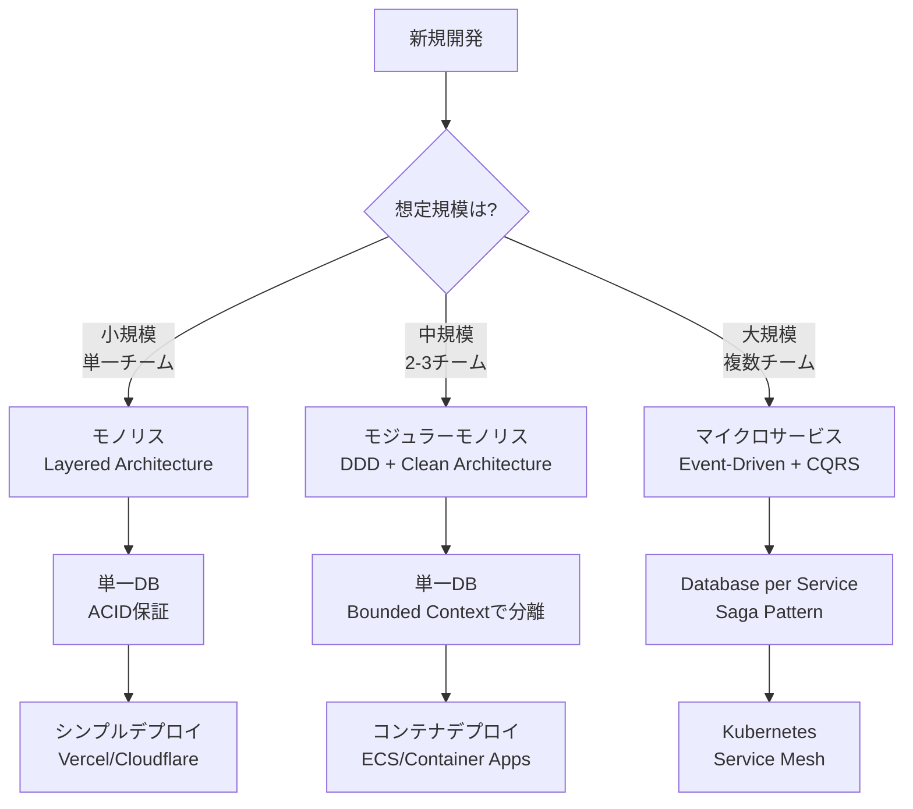

# IT業界総合用語集（全520選）統合版

## 1. プロジェクトマネジメント（70選）

### WBS・スケジュール関連
| # | 用語 | 概要 |
|---|------|------|
| 1 | WBS (Work Breakdown Structure) | 作業分解構成図。成果物・作業を階層的に分解 |
| 2 | ガントチャート | 横棒グラフ形式のスケジュール表 |
| 3 | マイルストーン | 重要な節目・中間目標地点 |
| 4 | クリティカルパス | 最長経路。遅延が全体に影響する作業の連鎖 |
| 5 | バッファ | 予備期間・余裕日数 |
| 6 | 工数 (人月/人日) | 作業量の単位。1人が1ヶ月/1日で行う作業量 |
| 7 | 山積み・山崩し | リソース負荷の可視化と平準化 |
| 8 | フロート (スラック) | 作業の余裕時間 |
| 9 | リードタイム | 着手から完了までの所要時間 |
| 10 | 前倒し/後ろ倒し | スケジュールの繰り上げ/繰り下げ |

### 進捗・実績管理
| # | 用語 | 概要 |
|---|------|------|
| 11 | 進捗率 | 作業の完了割合 (%) |
| 12 | EVM (Earned Value Management) | 出来高管理。PV/EV/ACで進捗・コスト分析 |
| 13 | PV (計画価値) | Planned Value。予定作業量の金額換算 |
| 14 | EV (出来高) | Earned Value。完了作業量の金額換算 |
| 15 | AC (実コスト) | Actual Cost。実際に投入したコスト |
| 16 | SPI/CPI | スケジュール/コスト効率指数 |
| 17 | 遅延日数 | 予定からの遅れ日数 |
| 18 | 実績工数 | 実際に消費した工数 |
| 19 | 消化率 | 予算・工数の使用割合 |
| 20 | 残工数 | 完了までに必要な残り工数 |

### フェーズ・工程
| # | 用語 | 概要 |
|---|------|------|
| 21 | 要件定義 (RD) | Requirements Definition |
| 22 | 基本設計 (BD/外部設計) | Basic Design。システム全体構造の設計 |
| 23 | 詳細設計 (DD/内部設計) | Detail Design。プログラム単位の設計 |
| 24 | 製造 (PG) | Programming。コーディング工程 |
| 25 | 単体テスト (UT) | Unit Test |
| 26 | 結合テスト (IT) | Integration Test |
| 27 | システムテスト (ST) | System Test |
| 28 | 受入テスト (UAT) | User Acceptance Test |
| 29 | 本番移行 | 本番環境への切り替え |
| 30 | 運用保守 | 稼働後の維持管理 |

### プロジェクト管理
| # | 用語 | 概要 |
|---|------|------|
| 31 | スコープ | プロジェクトの範囲・対象 |
| 32 | ステークホルダー | 利害関係者 |
| 33 | 成果物 (デリバラブル) | 納品物・提出物 |
| 34 | PMBOK | プロジェクト管理の知識体系 |
| 35 | QCD | Quality/Cost/Delivery。品質・コスト・納期 |
| 36 | リスク管理 | リスクの識別・分析・対応策策定 |
| 37 | 課題管理 | 発生した問題の追跡・解決管理 |
| 38 | 変更管理 | スコープ・仕様変更の統制 |
| 39 | コンティンジェンシー | 不測事態への予備費・予備時間 |
| 40 | ベースライン | 承認済み計画の基準線 |

### 会議・コミュニケーション
| # | 用語 | 概要 |
|---|------|------|
| 41 | キックオフ | プロジェクト開始会議 |
| 42 | 定例会 | 定期的な進捗確認会議 |
| 43 | ステコミ (Steering Committee) | 経営層向け意思決定会議 |
| 44 | レビュー | 成果物の検証・評価会議 |
| 45 | エスカレーション | 上位者への報告・判断仰ぎ |

### その他管理系
| # | 用語 | 概要 |
|---|------|------|
| 46 | 体制図 | プロジェクト組織構成図 |
| 47 | RACI | 責任分担マトリクス (Responsible/Accountable/Consulted/Informed) |
| 48 | 稼働率 | リソースの実働割合 |
| 49 | 再見積もり | 途中での見積もり見直し |
| 50 | 完了報告 | フェーズ・プロジェクト終了時の報告 |

### 生産性メトリクス
| # | 用語 | 概要 |
|---|------|------|
| 51 | FP (ファンクションポイント) | 機能規模測定単位 |
| 52 | SLOC | Source Lines of Code。ソースコード行数 |
| 53 | 生産性 (SLOC/hr) | 時間あたりのコード生産量 |
| 54 | チームサイズ | プロジェクトの人数規模 |
| 55 | コミュニケーションオーバーヘッド | 人数増加による効率低下 |

### ソフトウェア工学プロセス
| # | 用語 | 概要 |
|---|------|------|
| 56 | As-Is/To-Be分析 | 現状・将来のシステム分析 |
| 57 | トランザクション分析 | CRUD・状態遷移分析 |
| 58 | 機能要件 | システムが提供すべき機能 |
| 59 | 非機能要件 | 性能・セキュリティ・可用性等 |
| 60 | 論理ER図 | 概念的なデータモデル |
| 61 | 物理ER図 | 実装ベースのテーブル設計 |
| 62 | API仕様 | インターフェース定義 |
| 63 | 状態遷移図 | システム状態の遷移表現 |
| 64 | ACID原則 | トランザクションの性質 |
| 65 | Saga パターン | 分散トランザクション管理 |

### 設計原則
| # | 用語 | 概要 |
|---|------|------|
| 66 | DDD (Domain-Driven Design) | ドメイン駆動設計 |
| 67 | マイクロサービス | 小規模サービス分割アーキテクチャ |
| 68 | イベント駆動 | イベントベースの疎結合設計 |
| 69 | ステートレス | 状態を保持しない設計 |
| 70 | 観測可能性 (Observability) | 監視・ログ・トレース |

---

## 2. 品質管理・テスト（50選）

### 品質指標・メトリクス
| # | 用語 | 概要 |
|---|------|------|
| 71 | バグ密度 | KLOC (1000行) あたりのバグ件数 |
| 72 | 欠陥除去率 (DRE) | 工程内で検出・除去できた欠陥の割合 |
| 73 | テストカバレッジ | コードがテストで網羅されている割合 |
| 74 | ステップ数 (SLOC) | ソースコードの行数 |
| 75 | サイクロマティック複雑度 | コードの分岐複雑さの指標 |
| 76 | MTBF | Mean Time Between Failures。平均故障間隔 |
| 77 | MTTR | Mean Time To Repair。平均修復時間 |
| 78 | 品質コスト (CoQ) | 予防・評価・失敗コストの総和 |
| 79 | 不具合流出率 | 後工程・本番に流出した欠陥の割合 |
| 80 | 摘出率 | 各工程での欠陥検出率 |

### テスト種別・手法
| # | 用語 | 概要 |
|---|------|------|
| 81 | ホワイトボックステスト | 内部構造を把握したテスト |
| 82 | ブラックボックステスト | 仕様ベースの入出力テスト |
| 83 | 境界値分析 | 境界値付近を重点的にテスト |
| 84 | 同値分割 | 同等の結果を得る値をグループ化 |
| 85 | デシジョンテーブル | 条件と動作の組み合わせ表 |
| 86 | 状態遷移テスト | 状態と遷移の網羅性を確認 |
| 87 | 回帰テスト (リグレッション) | 修正による影響範囲の確認テスト |
| 88 | スモークテスト | 基本動作の簡易確認テスト |
| 89 | 探索的テスト | 仕様に縛られない発見型テスト |
| 90 | 負荷テスト | 高負荷時の挙動確認 |

### レビュー・検証
| # | 用語 | 概要 |
|---|------|------|
| 91 | インスペクション | 正式な欠陥検出レビュー |
| 92 | ウォークスルー | 作成者主導の説明型レビュー |
| 93 | ピアレビュー | 同僚間での相互レビュー |
| 94 | デザインレビュー (DR) | 設計成果物の公式審査 |
| 95 | コードレビュー | ソースコードの品質確認 |
| 96 | チェックリスト | 確認項目一覧による検証 |
| 97 | レビュー指摘密度 | ページ/KLOC あたりの指摘件数 |
| 98 | 静的解析 | 実行せずにコードを検査 |
| 99 | 動的解析 | 実行時の振る舞いを検査 |
| 100 | トレーサビリティ | 要件〜設計〜テストの追跡可能性 |

### 欠陥・障害管理
| # | 用語 | 概要 |
|---|------|------|
| 101 | バグ (欠陥/不具合) | プログラムの誤り |
| 102 | 障害 | バグが原因で発生した問題事象 |
| 103 | インシデント | 潜在的障害を含む事象全般 |
| 104 | 重要度 (Severity) | 欠陥の技術的深刻度 |
| 105 | 優先度 (Priority) | 対応の緊急度 |
| 106 | バグ曲線 (信頼度成長曲線) | 累積バグ数の収束傾向グラフ |
| 107 | ゴンペルツ曲線 | バグ収束予測モデル |
| 108 | オープン/クローズ | 未解決/解決済みの状態 |
| 109 | 再発防止策 | 同種問題の再発を防ぐ対策 |
| 110 | 根本原因分析 (RCA) | Root Cause Analysis。真因追究 |

### 品質保証プロセス
| # | 用語 | 概要 |
|---|------|------|
| 111 | QA (Quality Assurance) | 品質保証。プロセス全体の品質担保 |
| 112 | QC (Quality Control) | 品質管理。成果物の検査・是正 |
| 113 | 品質計画 | 品質目標・基準・手法の策定 |
| 114 | 品質ゲート | 次工程移行可否の判定ポイント |
| 115 | 出荷判定 | リリース可否の最終判定会議 |
| 116 | なぜなぜ分析 | 5回の「なぜ」で真因を探る手法 |
| 117 | PDCA | Plan-Do-Check-Act の改善サイクル |
| 118 | CMMI | 組織の成熟度評価モデル |
| 119 | ISO 9001 | 品質マネジメントシステム規格 |
| 120 | 標準偏差・シックスシグマ | 統計的品質管理の指標・手法 |

---

## 3. AI駆動開発・Agentic Coding（60選）

### Agentic Coding ツール
| # | 用語 | 概要 |
|---|------|------|
| 121 | Claude Code | Anthropic製。ターミナルベースのエージェント型コーディングツール |
| 122 | Codex CLI | OpenAI製。GPT-5系モデルでローカル自動化を実現 |
| 123 | Gemini CLI | Google製。Gemini 2.5 Pro、1Mトークンコンテキスト対応 |
| 124 | Cursor | AI統合IDE。コード補完・編集・チャット機能 |
| 125 | Roo Code | VS Code拡張のエージェント型ツール |
| 126 | GitHub Copilot | GitHub/Microsoft製。コード補完・チャット |
| 127 | Kiro | AWS製。仕様駆動開発に特化したIDE |
| 128 | Windsurf | Codeium製。エージェント型IDE |
| 129 | Aider | オープンソースのペアプログラミングAI |
| 130 | Devin | Cognition製。自律型AIソフトウェアエンジニア |

### 最新AIモデル
| # | 用語 | 概要 |
|---|------|------|
| 131 | GPT-5.2 | OpenAI最新。Instant/Thinking/Pro の3階層 |
| 132 | GPT-5.2 Pro | 最高精度。$21/$168/M。xhigh reasoning対応 |
| 133 | GPT-5.1 Codex | コーディング特化。SWE-bench 74.5% |
| 134 | GPT-5.1 Codex Max | 24時間超の自律タスク対応。SWE-bench 77.9% |
| 135 | Claude Opus 4.5 | Anthropic最高峰。$5/$25/M |
| 136 | Claude Sonnet 4.5 | SWE-bench 77.2%。30時間超の持続集中 |
| 137 | Claude Haiku 4.5 | 高速・低コスト。SWE-bench 73.3% |
| 138 | Gemini 3.0 Pro | Google最新。thinking_level対応、1M入力 |
| 139 | Gemini 2.5 Flash | 高速推論モデル。$0.3/$2.5/M |
| 140 | o1 / o3 | OpenAIの推論特化モデル系列 |

### 開発手法・概念
| # | 用語 | 概要 |
|---|------|------|
| 141 | Agentic Coding | AIエージェントが自律的にコーディングする手法 |
| 142 | SDD (仕様駆動開発) | Spec-Driven Development。自然言語仕様→AI実装 |
| 143 | AI-DLC | AI-Driven Development Lifecycle。AI中心の開発サイクル |
| 144 | cc-sdd | Claude Code用SDD拡張。.specファイルから自動生成 |
| 145 | spec-kit | Markdown/YAML形式の仕様ファイル管理フレームワーク |
| 146 | Vibe Coding | 雰囲気・意図を伝えてAIに実装させるスタイル |
| 147 | Human-in-the-Loop | 人間が検証・承認ゲートを担う方式 |
| 148 | Prompt Engineering | 効果的なAI指示の設計技術 |
| 149 | Context Engineering | AIに渡す文脈情報の最適化技術 |
| 150 | Chain of Thought (CoT) | 段階的推論を促すプロンプト手法 |

### API機能・出力制御
| # | 用語 | 概要 |
|---|------|------|
| 151 | Structured Output (構造化出力) | JSON Schema等に従った形式での出力強制 |
| 152 | JSON Mode | JSON形式での出力を保証するモード |
| 153 | Response Format | APIで出力形式を指定するパラメータ |
| 154 | Tool Use / Function Calling | AIが外部ツール・関数を呼び出す機能 |
| 155 | Streaming | レスポンスを逐次受信する方式 |
| 156 | Temperature | 出力のランダム性制御パラメータ (0=決定的) |
| 157 | Top-p (Nucleus Sampling) | 確率分布の上位p%から選択 |
| 158 | Max Tokens | 出力トークン数の上限設定 |
| 159 | Stop Sequences | 出力を停止するトリガー文字列 |
| 160 | System Prompt | モデルの振る舞いを規定する指示 |
| 161 | Reasoning Effort | 推論の深さ設定 (low/medium/high/xhigh) |
| 162 | Thinking Budget | 推論トークン量の割り当て設定 |

### MCP・ツール連携
| # | 用語 | 概要 |
|---|------|------|
| 163 | MCP | Model Context Protocol。AIとツールの接続規格 |
| 164 | MCP Server | ツール機能をAIに提供するサーバー |
| 165 | MCP Client | MCPサーバーに接続するAIツール側 |
| 166 | Browser MCP | Chrome DevTools/Playwright等のブラウザ操作連携 |
| 167 | Filesystem MCP | ファイルシステム操作のMCP |
| 168 | Database MCP | DB操作のMCP連携 |
| 169 | GitHub MCP | GitHub API連携のMCP |

### RAG・知識管理
| # | 用語 | 概要 |
|---|------|------|
| 170 | RAG (Retrieval-Augmented Generation) | 外部知識検索による生成強化 |
| 171 | Embeddings | テキストのベクトル化。類似検索に使用 |
| 172 | Vector Database | ベクトル埋め込みを格納・検索するDB |
| 173 | Chunking | 文書を適切なサイズに分割する処理 |
| 174 | Semantic Search | 意味的類似性に基づく検索 |
| 175 | Context Window | モデルが処理できる最大トークン数 |

### ベンチマーク・評価
| # | 用語 | 概要 |
|---|------|------|
| 176 | SWE-bench | ソフトウェアエンジニアリング能力ベンチマーク |
| 177 | SWE-bench Verified | 人間検証済みのSWE-bench |
| 178 | HumanEval | コード生成能力の評価指標 |
| 179 | GPQA Diamond | 大学院レベル科学問題ベンチマーク |
| 180 | ARC-AGI | 汎用知能評価ベンチマーク |

---

## 4. 技術スタック・フレームワーク（88選）

### フロントエンドフレームワーク
| # | 用語 | 概要 |
|---|------|------|
| 181 | Next.js | React製フルスタックフレームワーク。SSR/SSG/ISR対応 |
| 182 | React | Meta製UIライブラリ。コンポーネントベース |
| 183 | Vue.js | プログレッシブJSフレームワーク |
| 184 | Nuxt | Vue製フルスタックフレームワーク |
| 185 | Angular | Google製。TypeScript前提の大規模向けFW |
| 186 | Svelte | コンパイル時最適化。軽量・高速 |
| 187 | SvelteKit | Svelte製フルスタックフレームワーク |
| 188 | Astro | コンテンツ重視の静的サイトジェネレーター |
| 189 | Remix | React Router製。Web標準重視のフルスタックFW |
| 190 | SolidJS | 仮想DOMなし。React似の高速FW |

### バックエンドフレームワーク
| # | 用語 | 概要 |
|---|------|------|
| 191 | Spring Boot | Java製。エンタープライズ標準 |
| 192 | Spring Framework | DIコンテナ中心のJavaフレームワーク |
| 193 | Spring Security | 認証・認可ライブラリ |
| 194 | Spring Data JPA | DB操作の抽象化ライブラリ |
| 195 | Quarkus | GraalVM最適化のJavaフレームワーク |
| 196 | Micronaut | 軽量Javaマイクロサービス向けFW |
| 197 | Express.js | Node.js製。軽量Webフレームワーク |
| 198 | NestJS | Node.js製。Angular風の構造化FW |
| 199 | Fastify | Node.js製。高速API向けFW |
| 200 | Hono | 軽量・高速。Cloudflare Workers対応 |
| 201 | Django | Python製。フルスタックフレームワーク |
| 202 | FastAPI | Python製。高速API開発。型ヒント活用 |
| 203 | Flask | Python製。軽量マイクロフレームワーク |
| 204 | Ruby on Rails | Ruby製。規約重視のフルスタックFW |
| 205 | Laravel | PHP製。人気のフルスタックFW |
| 206 | ASP.NET Core | Microsoft製。C#/.NET向けFW |
| 207 | Go (Gin/Echo) | Go言語用軽量Webフレームワーク |
| 208 | Rust (Actix/Axum) | Rust言語用高速Webフレームワーク |

### レンダリング方式
| # | 用語 | 概要 |
|---|------|------|
| 209 | CSR (Client Side Rendering) | クライアント側でHTML生成 |
| 210 | SSR (Server Side Rendering) | サーバー側でHTML生成 |
| 211 | SSG (Static Site Generation) | ビルド時に静的HTML生成 |
| 212 | ISR (Incremental Static Regeneration) | 段階的な静的再生成 |
| 213 | RSC (React Server Components) | サーバーで実行されるReactコンポーネント |
| 214 | Hydration | 静的HTMLにJSを適用して動的化 |
| 215 | Partial Hydration | 必要な部分のみHydration |
| 216 | Streaming SSR | HTMLを逐次送信するSSR |

### データベース・ORM
| # | 用語 | 概要 |
|---|------|------|
| 217 | Prisma | TypeScript製ORM。型安全なDB操作 |
| 218 | Drizzle | 軽量TypeScript ORM。SQLライク |
| 219 | TypeORM | TypeScript/JavaScript用ORM |
| 220 | Hibernate | Java標準ORM。JPA実装 |
| 221 | MyBatis | SQLマッパー。SQLを直接記述 |
| 222 | Sequelize | Node.js用ORM |
| 223 | SQLAlchemy | Python用ORM |
| 224 | PostgreSQL | オープンソースRDB |
| 225 | MySQL | オープンソースRDB |
| 226 | Oracle Database | エンタープライズRDB |
| 227 | SQL Server | Microsoft製RDB |
| 228 | MongoDB | ドキュメント指向NoSQL |
| 229 | Redis | インメモリKVS |
| 230 | Cassandra | 分散型NoSQL |

### スタイリング・UI
| # | 用語 | 概要 |
|---|------|------|
| 231 | Tailwind CSS | ユーティリティファーストCSSフレームワーク |
| 232 | shadcn/ui | Radix UIベースの再利用可能コンポーネント集 |
| 233 | Radix UI | アクセシブルなヘッドレスUIライブラリ |
| 234 | Material UI (MUI) | Googleマテリアルデザイン実装 |
| 235 | Chakra UI | アクセシブルなReactコンポーネント |
| 236 | Ant Design | Alibaba製エンタープライズ向けUI |
| 237 | CSS Modules | スコープ付きCSSの実現手法 |
| 238 | Styled Components | CSS-in-JSライブラリ |

### 状態管理・データフェッチ
| # | 用語 | 概要 |
|---|------|------|
| 239 | Redux | Fluxアーキテクチャの状態管理 |
| 240 | Zustand | 軽量状態管理ライブラリ |
| 241 | Jotai | アトムベースの状態管理 |
| 242 | TanStack Query (React Query) | サーバー状態管理・キャッシュ |
| 243 | SWR | Vercel製データフェッチライブラリ |
| 244 | tRPC | 型安全なAPIクライアント・サーバー |
| 245 | GraphQL | クエリ言語。必要なデータのみ取得 |
| 246 | Apollo Client | GraphQLクライアントライブラリ |
| 247 | REST API | リソース指向のAPI設計スタイル |

### CI/CD・開発ツール
| # | 用語 | 概要 |
|---|------|------|
| 248 | GitHub Actions | GitHub統合CI/CD |
| 249 | GitLab CI/CD | GitLab統合CI/CD |
| 250 | Jenkins | オープンソースCI/CDツール |
| 251 | CircleCI | クラウドCI/CDサービス |
| 252 | Docker | コンテナ化プラットフォーム |
| 253 | Kubernetes (K8s) | コンテナオーケストレーション |
| 254 | Terraform | IaCツール。マルチクラウド対応 |
| 255 | Ansible | 構成管理自動化ツール |
| 256 | VS Code | Microsoft製軽量エディタ |
| 257 | IntelliJ IDEA | JetBrains製Java IDE |
| 258 | Git | 分散バージョン管理システム |
| 259 | GitHub | Gitホスティング・協業プラットフォーム |
| 260 | TDD (Test-Driven Development) | テスト駆動開発 |
| 261 | BDD (Behavior-Driven Development) | 振る舞い駆動開発 |
| 262 | Playwright | E2Eテストフレームワーク |
| 263 | Jest | JavaScriptテストフレームワーク |
| 264 | Vitest | Vite製高速テストフレームワーク |
| 265 | JUnit | Javaテストフレームワーク |
| 266 | pytest | Pythonテストフレームワーク |
| 267 | ESLint | JavaScript/TypeScript Linter |
| 268 | Prettier | コードフォーマッター |

---

## 5. クラウド・インフラ（80選）

### Cloudflare
| # | 用語 | 概要 |
|---|------|------|
| 269 | Cloudflare Workers | エッジで実行するサーバーレス関数 |
| 270 | Cloudflare Pages | 静的サイト/フルスタックホスティング |
| 271 | Cloudflare D1 | エッジSQLite データベース |
| 272 | Cloudflare R2 | S3互換オブジェクトストレージ（エグレス無料） |
| 273 | Cloudflare KV | エッジKey-Valueストア |
| 274 | Durable Objects | ステートフルなエッジコンピューティング |
| 275 | Cloudflare Queues | メッセージキューサービス |
| 276 | Cloudflare CDN | コンテンツ配信ネットワーク |
| 277 | Cloudflare WAF | Webアプリケーションファイアウォール |
| 278 | Wrangler | Workers/Pages用CLI開発ツール |

### AWS
| # | 用語 | 概要 |
|---|------|------|
| 279 | EC2 | 仮想サーバー (IaaS) |
| 280 | Lambda | サーバーレス関数 |
| 281 | ECS | コンテナオーケストレーション |
| 282 | EKS | マネージドKubernetes |
| 283 | Fargate | サーバーレスコンテナ実行環境 |
| 284 | S3 | オブジェクトストレージ |
| 285 | RDS | マネージドリレーショナルDB |
| 286 | Aurora | 高性能MySQL/PostgreSQL互換DB |
| 287 | DynamoDB | マネージドNoSQL |
| 288 | ElastiCache | インメモリキャッシュ (Redis/Memcached) |
| 289 | CloudFront | CDN |
| 290 | API Gateway | API管理・公開サービス |
| 291 | SQS | メッセージキュー |
| 292 | SNS | Pub/Sub通知サービス |
| 293 | EventBridge | イベント駆動連携 |
| 294 | Step Functions | ワークフローオーケストレーション |
| 295 | IAM | 認証・認可管理 |
| 296 | VPC | 仮想プライベートネットワーク |
| 297 | Route 53 | DNS/ドメイン管理 |
| 298 | CloudWatch | 監視・ログ・アラート |
| 299 | CloudFormation | IaC (Infrastructure as Code) |
| 300 | CDK | プログラマブルIaC |
| 301 | Cognito | 認証・ユーザー管理 |
| 302 | Bedrock | 生成AI基盤サービス |

### Azure
| # | 用語 | 概要 |
|---|------|------|
| 303 | Azure Virtual Machines | 仮想サーバー |
| 304 | Azure Functions | サーバーレス関数 |
| 305 | Azure Container Apps | サーバーレスコンテナ |
| 306 | Azure Container Instances (ACI) | コンテナ実行環境 |
| 307 | AKS | マネージドKubernetes |
| 308 | Azure App Service | PaaSアプリホスティング |
| 309 | Azure Blob Storage | オブジェクトストレージ |
| 310 | Azure SQL Database | マネージドSQL Server |
| 311 | Cosmos DB | グローバル分散NoSQL |
| 312 | Azure Cache for Redis | マネージドRedis |
| 313 | Azure CDN / Front Door | CDN・グローバル負荷分散 |
| 314 | API Management | API管理・公開 |
| 315 | Service Bus | エンタープライズメッセージング |
| 316 | Event Grid | イベント駆動連携 |
| 317 | Azure AD (Entra ID) | ID・アクセス管理 |
| 318 | Azure DevOps | CI/CD・リポジトリ・ボード |
| 319 | ARM Templates / Bicep | IaC |
| 320 | Azure Monitor | 監視・ログ・アラート |
| 321 | Azure OpenAI Service | OpenAIモデルのマネージドサービス |

### OCI (Oracle Cloud Infrastructure)
| # | 用語 | 概要 |
|---|------|------|
| 322 | OCI Compute | 仮想サーバー |
| 323 | OCI Functions | サーバーレス関数 |
| 324 | OCI Container Instances | サーバーレスコンテナ |
| 325 | OKE | マネージドKubernetes |
| 326 | OCI Object Storage | オブジェクトストレージ |
| 327 | Autonomous Database | 自己管理型Oracle DB |
| 328 | OCI MySQL HeatWave | 高速分析対応MySQL |
| 329 | OCI NoSQL | マネージドNoSQL |
| 330 | OCI Load Balancer | 負荷分散 |
| 331 | OCI API Gateway | API管理・公開 |
| 332 | OCI IAM | 認証・認可管理 |
| 333 | OCI VCN | 仮想クラウドネットワーク |
| 334 | OCI DevOps | CI/CDパイプライン |
| 335 | Resource Manager | Terraform管理サービス |
| 336 | OCI Generative AI | 生成AIサービス |

### インフラ用語
| # | 用語 | 概要 |
|---|------|------|
| 337 | IaaS | Infrastructure as a Service。仮想サーバー提供 |
| 338 | PaaS | Platform as a Service。アプリ実行環境提供 |
| 339 | SaaS | Software as a Service。完成アプリ提供 |
| 340 | サーバーレス | サーバー管理不要のコンピューティング |
| 341 | マルチAZ | 複数アベイラビリティゾーン配置 |
| 342 | マルチリージョン | 複数地域配置 |
| 343 | オートスケール | 負荷に応じた自動スケーリング |
| 344 | ロードバランサー | 負荷分散装置 |
| 345 | CDN | Content Delivery Network |
| 346 | エッジコンピューティング | ユーザー近傍での処理実行 |
| 347 | オブジェクトストレージ | 非構造化データの保存 |
| 348 | ブロックストレージ | 仮想ディスク |

---

## 6. ドキュメンテーション・図表（60選）

### Markdown
| # | 用語 | 概要 |
|---|------|------|
| 349 | Markdown | 軽量マークアップ言語。プレーンテキストで構造化文書 |
| 350 | GFM (GitHub Flavored Markdown) | GitHub拡張Markdown。テーブル・チェックボックス等 |
| 351 | CommonMark | Markdown標準化仕様 |
| 352 | MDX | Markdown + JSX。React コンポーネント埋め込み |
| 353 | Front Matter | YAML/TOMLによるメタデータ記述領域 |
| 354 | Fenced Code Block | \`\`\`で囲むコードブロック |
| 355 | Syntax Highlighting | コードの構文強調表示 |
| 356 | Callout / Admonition | 注意・警告等の装飾ブロック |
| 357 | Table of Contents (TOC) | 見出しから自動生成する目次 |
| 358 | Anchor Link | 見出しへの内部リンク |

### Mermaid
| # | 用語 | 概要 |
|---|------|------|
| 359 | Mermaid.js | テキストベースの図表生成ライブラリ |
| 360 | Flowchart | フローチャート。処理の流れを表現 |
| 361 | Sequence Diagram | シーケンス図。時系列のやり取り |
| 362 | Class Diagram | クラス図。オブジェクト構造 |
| 363 | State Diagram | 状態遷移図 |
| 364 | ER Diagram | エンティティ関連図。DB設計 |
| 365 | Gantt Chart | ガントチャート。スケジュール表現 |
| 366 | Pie Chart | 円グラフ |
| 367 | Mindmap | マインドマップ。階層的アイデア整理 |
| 368 | Timeline | タイムライン。時系列イベント |
| 369 | Git Graph | Gitブランチ・コミット履歴可視化 |
| 370 | C4 Diagram | ソフトウェアアーキテクチャ図 |
| 371 | xychart-beta | X-Y軸グラフ（折れ線・棒） |

### 図表作成ツール
| # | 用語 | 概要 |
|---|------|------|
| 372 | Draw.io (diagrams.net) | 無料のWeb/デスクトップ作図ツール |
| 373 | Lucidchart | クラウド作図ツール。コラボレーション対応 |
| 374 | Figma | UIデザイン・プロトタイピングツール |
| 375 | Excalidraw | 手書き風ホワイトボードツール |
| 376 | tldraw | 軽量ホワイトボード。OSS |
| 377 | PlantUML | テキストベースUML作成ツール |
| 378 | Graphviz | DOT言語によるグラフ描画 |
| 379 | Whimsical | フローチャート・ワイヤーフレーム |
| 380 | Miro | オンラインホワイトボード。コラボ向け |

### 画像フォーマット
| # | 用語 | 概要 |
|---|------|------|
| 381 | SVG (Scalable Vector Graphics) | XMLベースのベクター画像形式 |
| 382 | PNG | 可逆圧縮ラスター画像。透過対応 |
| 383 | JPEG | 非可逆圧縮。写真向け |
| 384 | WebP | Google製。高圧縮率・透過対応 |
| 385 | AVIF | 次世代画像形式。最高圧縮率 |
| 386 | GIF | アニメーション対応。256色制限 |
| 387 | PDF | 印刷・配布向け文書形式 |

### SVG詳細
| # | 用語 | 概要 |
|---|------|------|
| 388 | ViewBox | SVGの座標系・表示領域定義 |
| 389 | Path | パス要素。複雑な形状描画 |
| 390 | Stroke / Fill | 線色 / 塗りつぶし色 |
| 391 | Transform | 変形（移動・回転・拡大縮小） |
| 392 | ClipPath | クリッピングマスク |

### UML図の種類
| # | 用語 | 概要 |
|---|------|------|
| 393 | ユースケース図 | システム機能とアクターの関係 |
| 394 | クラス図 | クラス構造・継承・関連 |
| 395 | シーケンス図 | オブジェクト間の時系列メッセージ |
| 396 | アクティビティ図 | 処理フロー・並行処理 |
| 397 | 状態マシン図 | 状態と遷移 |
| 398 | コンポーネント図 | システム構成要素と依存関係 |
| 399 | 配置図 | 物理的なデプロイ構成 |
| 400 | オブジェクト図 | 特定時点のインスタンス関係 |

### ドキュメント管理
| # | 用語 | 概要 |
|---|------|------|
| 401 | Docs as Code | ドキュメントをコードと同様にGit管理 |
| 402 | Single Source of Truth | 単一の信頼できる情報源 |
| 403 | バージョン管理 | Git等による履歴管理 |
| 404 | Wiki | 共同編集可能なドキュメント |
| 405 | Confluence | Atlassian製ドキュメント管理 |
| 406 | Notion | オールインワンワークスペース |
| 407 | Docusaurus | Meta製ドキュメントサイトジェネレーター |
| 408 | VuePress | Vue製ドキュメントサイトジェネレーター |

---

## 7. 契約・受発注・商流（60選）

### 契約形態
| # | 用語 | 概要 |
|---|------|------|
| 409 | 請負契約 | 成果物の完成を約束。瑕疵担保責任あり |
| 410 | 準委任契約 | 業務遂行を約束。成果物責任なし |
| 411 | 派遣契約 | 労働者を派遣。指揮命令権は派遣先 |
| 412 | SES (システムエンジニアリングサービス) | 準委任ベースの技術者提供 |
| 413 | 委任契約 | 法律行為を委託（弁護士等） |
| 414 | 業務委託契約 | 請負・準委任の総称 |
| 415 | ラボ契約 | 一定期間チームを専属確保 |
| 416 | 保守契約 | 運用・保守業務の継続契約 |
| 417 | ライセンス契約 | ソフトウェア使用権の許諾 |
| 418 | サブスクリプション契約 | 定額課金型サービス利用契約 |

### 請負 vs 準委任 詳細
| # | 用語 | 概要 |
|---|------|------|
| 419 | 成果物責任 | 請負：あり / 準委任：なし |
| 420 | 契約不適合責任 (旧・瑕疵担保) | 請負：納品後も責任 / 準委任：なし |
| 421 | 善管注意義務 | 準委任：専門家として注意を払う義務 |
| 422 | 報告義務 | 準委任：進捗・状況報告の義務 |
| 423 | 指揮命令権 | 請負/準委任：受託側 / 派遣：発注側 |
| 424 | 偽装請負 | 請負/準委任なのに発注側が指揮命令（違法） |
| 425 | 多重下請け | 再委託の連鎖構造 |
| 426 | 再委託 | 受託業務を第三者へ委託 |

### 見積・提案
| # | 用語 | 概要 |
|---|------|------|
| 427 | RFI (情報提供依頼) | Request for Information。情報収集 |
| 428 | RFP (提案依頼書) | Request for Proposal。正式な提案要求 |
| 429 | RFQ (見積依頼書) | Request for Quotation。価格見積依頼 |
| 430 | 提案書 | RFPへの回答。技術・体制・価格提案 |
| 431 | 見積書 | 費用・工数の明細書 |
| 432 | 概算見積 | 精度±30%程度のラフ見積 |
| 433 | 詳細見積 | 精度±10%程度の確定見積 |
| 434 | 相見積 (あいみつ) | 複数社から見積取得・比較 |
| 435 | コンペ | 複数社の提案を競わせる選定 |
| 436 | プレゼン | 提案内容の説明・プレゼンテーション |

### 発注・契約締結
| # | 用語 | 概要 |
|---|------|------|
| 437 | 内示 | 正式発注前の非公式な発注意思表示 |
| 438 | 発注書 (注文書) | 正式な発注の書面 |
| 439 | 注文請書 | 発注を受諾する書面 |
| 440 | 基本契約書 | 継続取引の基本条件を定める契約 |
| 441 | 個別契約書 | 案件ごとの具体条件を定める契約 |
| 442 | 覚書 | 契約の補足・変更を記載 |
| 443 | NDA (秘密保持契約) | Non-Disclosure Agreement |
| 444 | SLA (サービスレベル契約) | サービス品質の保証・合意 |
| 445 | MSA (基本サービス契約) | Master Service Agreement |
| 446 | SOW (作業範囲記述書) | Statement of Work。作業範囲定義 |

### 検収・支払
| # | 用語 | 概要 |
|---|------|------|
| 447 | 納品書 | 成果物納品時の明細書 |
| 448 | 検収 | 成果物の確認・受領判定 |
| 449 | 検収書 | 検収完了を証明する書面 |
| 450 | 検収期間 | 検収に要する期間（通常2週間〜1ヶ月） |
| 451 | 請求書 | 代金請求の明細書 |
| 452 | 支払サイト | 締日から支払日までの期間 |
| 453 | 月末締め翌月末払い | 一般的な支払条件例 |
| 454 | 分割払い | マイルストーンごとの段階支払 |
| 455 | 前払金 | 着手時に支払う一部金額 |
| 456 | 出来高払い | 進捗に応じた支払方式 |

### 料金体系
| # | 用語 | 概要 |
|---|------|------|
| 457 | 一括請負 | 固定価格での成果物納品 |
| 458 | 人月単価 | 1人1ヶ月あたりの単価 |
| 459 | 時間単価 (チャージ) | 1時間あたりの単価 |
| 460 | T&M (Time and Materials) | 実費精算型 |
| 461 | 定額制 | 月額固定料金 |
| 462 | 従量課金 | 使用量に応じた課金 |
| 463 | 成功報酬 | 成果達成時のみ報酬発生 |
| 464 | レベニューシェア | 売上に応じた報酬配分 |

### 変更・終了
| # | 用語 | 概要 |
|---|------|------|
| 465 | 変更管理 | スコープ・仕様変更の正式手続き |
| 466 | 追加見積 | 変更に伴う追加費用の見積 |
| 467 | 契約解除 | 契約の中途終了 |
| 468 | 損害賠償条項 | 契約違反時の賠償責任規定 |

---

## 8. 企業・組織（52選 - 主要企業抜粋）

### IT・SIer
| # | 企業名 | 概要 |
|---|------|------|
| 469 | システムエグゼ | 独立系SIer。DB・業務システム・自社製品 |
| 470 | NTTデータ | 国内最大級SIer |
| 471 | 富士通 | 総合ITベンダー |
| 472 | NEC | 総合電機・SIer |
| 473 | 日立製作所 | 総合電機・社会インフラIT |
| 474 | 野村総合研究所 (NRI) | シンクタンク・SIer |
| 475 | 伊藤忠テクノソリューションズ (CTC) | 商社系SIer |
| 476 | SCSK | 住商系SIer |
| 477 | TIS | 独立系大手SIer |

### エネルギー
| # | 企業名 | 概要 |
|---|------|------|
| 478 | 出光興産 | 石油元売り大手 |
| 479 | ENEOS | 石油元売り最大手 |
| 480 | 東京電力 (TEPCO) | 電力最大手 |
| 481 | 関西電力 | 電力大手 |
| 482 | 東京ガス | 都市ガス最大手 |

### 不動産・建設
| # | 企業名 | 概要 |
|---|------|------|
| 483 | 三井不動産 | 総合不動産最大手 |
| 484 | 三菱地所 | 丸の内開発、総合不動産 |
| 485 | 住友不動産 | 総合不動産大手 |
| 486 | 大和ハウス工業 | 住宅・建設最大手 |
| 487 | 鹿島建設 | スーパーゼネコン |

### 製造業（機械・重工）
| # | 企業名 | 概要 |
|---|------|------|
| 488 | コマツ (小松製作所) | 建設機械世界2位 |
| 489 | 日立建機 | 建設機械大手 |
| 490 | 三菱重工業 | 総合重工最大手 |
| 491 | ダイキン工業 | 空調機器世界首位 |
| 492 | ファナック | 産業用ロボット・CNC |

### 自動車
| # | 企業名 | 概要 |
|---|------|------|
| 493 | トヨタ自動車 | 自動車世界首位級 |
| 494 | 本田技研工業 (Honda) | 自動車・二輪 |
| 495 | 日産自動車 | 自動車大手 |
| 496 | デンソー | 自動車部品世界大手 |

### 電機・精密
| # | 企業名 | 概要 |
|---|------|------|
| 497 | ソニーグループ | 総合エレクトロニクス・エンタメ |
| 498 | パナソニック | 総合電機 |
| 499 | キヤノン | カメラ・複合機 |
| 500 | キーエンス | FA センサー。高収益 |

### 金融
| # | 企業名 | 概要 |
|---|------|------|
| 501 | 三菱UFJフィナンシャル・グループ | メガバンク最大手 |
| 502 | 三井住友フィナンシャルグループ | メガバンク |
| 503 | みずほフィナンシャルグループ | メガバンク |
| 504 | 野村ホールディングス | 証券最大手 |

### 商社
| # | 企業名 | 概要 |
|---|------|------|
| 505 | 三菱商事 | 総合商社最大手 |
| 506 | 三井物産 | 総合商社 |
| 507 | 伊藤忠商事 | 総合商社 |
| 508 | 住友商事 | 総合商社 |

### 小売・通信
| # | 企業名 | 概要 |
|---|------|------|
| 509 | イオン | 小売最大手 |
| 510 | セブン&アイ・ホールディングス | コンビニ・小売 |
| 511 | ファーストリテイリング | ユニクロ運営 |
| 512 | NTT | 通信最大手 |
| 513 | KDDI | 通信大手 (au) |
| 514 | ソフトバンク | 通信・投資 |
| 515 | 楽天グループ | EC・通信・金融 |

### 製薬・食品
| # | 企業名 | 概要 |
|---|------|------|
| 516 | 武田薬品工業 | 製薬国内最大手 |
| 517 | サントリー | 飲料・酒類 |
| 518 | キリンホールディングス | 飲料・医薬 |
| 519 | 味の素 | 食品・アミノ酸 |
| 520 | 資生堂 | 化粧品 |

## 9. GitHub 関連用語（50選）

### リポジトリ・ブランチ
| # | 用語 | 概要 |
|---|------|------|
| 521 | Repository (リポジトリ) | プロジェクトのコード・履歴を保存する場所 |
| 522 | Fork | 他人のリポジトリを自分のアカウントにコピー |
| 523 | Clone | リポジトリをローカルに複製 |
| 524 | Branch (ブランチ) | 開発の分岐。main/develop/feature等 |
| 525 | main / master | メインブランチ。本番用コード |
| 526 | develop | 開発統合ブランチ |
| 527 | feature/* | 機能開発ブランチ |
| 528 | hotfix/* | 緊急修正ブランチ |
| 529 | release/* | リリース準備ブランチ |
| 530 | Git Flow | ブランチ運用戦略 |

### コミット・プッシュ
| # | 用語 | 概要 |
|---|------|------|
| 531 | Commit (コミット) | 変更を記録 |
| 532 | Push (プッシュ) | ローカルの変更をリモートへ送信 |
| 533 | Pull (プル) | リモートの変更をローカルへ取得 |
| 534 | Fetch | リモートの情報を取得（マージなし） |
| 535 | Merge | ブランチを統合 |
| 536 | Rebase | コミット履歴を整理して統合 |
| 537 | Cherry-pick | 特定のコミットのみを適用 |
| 538 | Squash | 複数コミットを1つにまとめる |
| 539 | Amend | 直前のコミットを修正 |
| 540 | Commit Message | コミットの説明文 |

### Pull Request
| # | 用語 | 概要 |
|---|------|------|
| 541 | Pull Request (PR) | コード変更のレビュー依頼 |
| 542 | Draft PR | 作業中PR。レビュー前の共有 |
| 543 | Code Review | PRのコードレビュー |
| 544 | Approve | PRの承認 |
| 545 | Request Changes | 修正要求 |
| 546 | Comment | レビューコメント |
| 547 | Merge Conflict | マージ時の衝突 |
| 548 | Resolve Conflict | 衝突解決 |
| 549 | Merge Strategy | マージ方式（Merge/Squash/Rebase） |
| 550 | CODEOWNERS | 自動レビュアー設定ファイル |

### Issues・プロジェクト管理
| # | 用語 | 概要 |
|---|------|------|
| 551 | Issue | タスク・バグ・質問等の管理単位 |
| 552 | Label | Issue分類タグ（bug/enhancement等） |
| 553 | Milestone | Issue/PRのグループ化（バージョン等） |
| 554 | Assignee | 担当者 |
| 555 | Projects | カンバンボード形式のプロジェクト管理 |
| 556 | Discussions | フォーラム形式の議論機能 |
| 557 | Wiki | プロジェクトドキュメント |
| 558 | README.md | リポジトリ説明ファイル |
| 559 | CONTRIBUTING.md | 貢献ガイドライン |
| 560 | Issue Template | Issue作成テンプレート |

### GitHub Actions・自動化
| # | 用語 | 概要 |
|---|------|------|
| 561 | GitHub Actions | CI/CD自動化機能 |
| 562 | Workflow | 自動化処理の定義 |
| 563 | Job | Workflow内の作業単位 |
| 564 | Step | Job内の個別処理 |
| 565 | Runner | Workflowを実行する環境 |
| 566 | Trigger | Workflow起動条件（push/PR等） |
| 567 | Artifact | ビルド成果物の保存 |
| 568 | Cache | 依存関係のキャッシュ |
| 569 | Secret | 機密情報の安全な保存 |
| 570 | Environment | デプロイ先環境設定 |

### セキュリティ・保護
| # | 用語 | 概要 |
|---|------|------|
| 571 | Branch Protection | ブランチへの直接Push禁止等 |
| 572 | Required Reviews | マージ前に必須のレビュー数 |
| 573 | Status Check | CI成功を必須条件化 |
| 574 | Dependabot | 依存関係の脆弱性自動検出 |
| 575 | Security Advisory | セキュリティ脆弱性の報告 |
| 576 | Code Scanning | コードの脆弱性スキャン |
| 577 | Secret Scanning | 誤ってコミットされた秘密情報検出 |
| 578 | .gitignore | Git管理対象外ファイル指定 |
| 579 | Personal Access Token (PAT) | API認証用トークン |
| 580 | SSH Key | SSH接続用の鍵 |

---

## 10. Visual Studio Code 関連用語（40選）

### 基本機能
| # | 用語 | 概要 |
|---|------|------|
| 581 | VS Code | Microsoft製軽量エディタ |
| 582 | Command Palette | コマンド検索・実行（Ctrl+Shift+P） |
| 583 | Quick Open | ファイル高速検索（Ctrl+P） |
| 584 | Explorer | ファイルツリー表示パネル |
| 585 | Editor | コード編集領域 |
| 586 | Split Editor | 画面分割表示 |
| 587 | Sidebar | サイドバー（Explorer/Search等） |
| 588 | Status Bar | ステータスバー（下部情報表示） |
| 589 | Activity Bar | アクティビティバー（左端アイコン） |
| 590 | Breadcrumb | ファイルパス階層表示 |

### 編集機能
| # | 用語 | 概要 |
|---|------|------|
| 591 | IntelliSense | コード補完・ヒント表示 |
| 592 | Multi-cursor | 複数カーソル同時編集 |
| 593 | Code Formatting | コード整形（Shift+Alt+F） |
| 594 | Find and Replace | 検索・置換 |
| 595 | Go to Definition | 定義元へジャンプ（F12） |
| 596 | Peek Definition | 定義をポップアップ表示 |
| 597 | Code Action | 自動修正候補表示（電球アイコン） |
| 598 | Refactoring | リファクタリング支援 |
| 599 | Snippet | コードテンプレート |
| 600 | Emmet | HTML/CSS省略記法展開 |

### 拡張機能
| # | 用語 | 概要 |
|---|------|------|
| 601 | Extension (拡張機能) | 機能追加プラグイン |
| 602 | Extension Marketplace | 拡張機能ストア |
| 603 | Language Support | 言語サポート拡張 |
| 604 | Linter | コード静的解析ツール |
| 605 | Formatter | コード整形ツール |
| 606 | Theme | カラーテーマ |
| 607 | Icon Theme | ファイルアイコンテーマ |
| 608 | Remote Development | リモート開発拡張 |
| 609 | Live Share | リアルタイム共同編集 |
| 610 | GitHub Copilot | AI コード補完 |

### デバッグ・ターミナル
| # | 用語 | 概要 |
|---|------|------|
| 611 | Debug | デバッグ機能 |
| 612 | Breakpoint | ブレークポイント（中断点） |
| 613 | Watch | 変数監視 |
| 614 | Call Stack | 呼び出し履歴 |
| 615 | Integrated Terminal | 統合ターミナル |
| 616 | Task | 自動化タスク（ビルド等） |
| 617 | launch.json | デバッグ設定ファイル |
| 618 | tasks.json | タスク設定ファイル |

### 設定・ワークスペース
| # | 用語 | 概要 |
|---|------|------|
| 619 | Settings | 設定（UI/JSON両方） |
| 620 | User Settings | ユーザー全体設定 |
| 621 | Workspace Settings | ワークスペース固有設定 |
| 622 | settings.json | JSON形式の設定ファイル |
| 623 | Workspace | 複数フォルダをまとめた作業領域 |
| 624 | .vscode/ | プロジェクト設定フォルダ |
| 625 | Keybindings | キーボードショートカット設定 |
| 626 | Profiles | 設定プロファイル（用途別切替） |

### リモート・連携
| # | 用語 | 概要 |
|---|------|------|
| 627 | Remote - SSH | SSH経由でリモート開発 |
| 628 | Remote - Containers | Docker コンテナ内で開発 |
| 629 | Remote - WSL | Windows Subsystem for Linux連携 |
| 630 | GitHub Codespaces | クラウドベースVS Code環境 |

---

## 11. Proxy・ネットワーク関連用語（30選）

### Proxy基礎
| # | 用語 | 概要 |
|---|------|------|
| 631 | Proxy (プロキシ) | 中継サーバー。クライアントとサーバー間に介在 |
| 632 | HTTP Proxy | HTTP通信を中継するProxy |
| 633 | HTTPS Proxy | HTTPS通信を中継するProxy |
| 634 | SOCKS Proxy | アプリケーション層Proxy。全TCP/UDP対応 |
| 635 | Forward Proxy | クライアント側Proxy。企業ファイアウォール等 |
| 636 | Reverse Proxy | サーバー側Proxy。負荷分散・キャッシュ等 |
| 637 | Transparent Proxy | 透過型Proxy。クライアント設定不要 |
| 638 | Anonymous Proxy | 匿名Proxy。送信元IPを隠蔽 |

### Proxy設定
| # | 用語 | 概要 |
|---|------|------|
| 639 | Proxy Server | Proxyサーバーのホスト名/IP |
| 640 | Proxy Port | Proxyのポート番号（通常8080/3128等） |
| 641 | Proxy Authentication | Proxy認証（Basic/NTLM/Kerberos） |
| 642 | PAC (Proxy Auto-Config) | 自動Proxy設定スクリプト |
| 643 | WPAD | Web Proxy Auto-Discovery。PAC自動検出 |
| 644 | No Proxy | Proxy除外設定。localhost/内部IP等 |
| 645 | Bypass Proxy | Proxy迂回リスト |
| 646 | HTTP_PROXY 環境変数 | HTTP Proxy設定の環境変数 |
| 647 | HTTPS_PROXY 環境変数 | HTTPS Proxy設定の環境変数 |
| 648 | NO_PROXY 環境変数 | Proxy除外リストの環境変数 |

### 問題・トラブル
| # | 用語 | 概要 |
|---|------|------|
| 649 | Proxy認証エラー | 認証失敗によるProxy接続エラー |
| 650 | SSL Inspection | ProxyによるSSL通信の復号・検査 |
| 651 | 中間者攻撃 (MITM) | Proxyによる通信の傍受リスク |
| 652 | Timeout | Proxy経由時のタイムアウト |
| 653 | Connection Refused | Proxy接続拒否 |
| 654 | 407 Proxy Authentication Required | Proxy認証要求HTTPステータス |

### ツール・設定
| # | 用語 | 概要 |
|---|------|------|
| 655 | otak-proxy | VS Code/Git/npm一括Proxy設定ツール |
| 656 | cntlm | NTLM認証Proxy対応の中継ツール |
| 657 | Proxifier | Windows用Proxyトンネリングツール |
| 658 | Corporate Proxy | 企業内Proxy。アクセス制限・監視 |
| 659 | VPN (Virtual Private Network) | 仮想プライベートネットワーク |
| 660 | Tunneling | トンネリング。暗号化通信路確立 |

---

## 12. バージョン管理・Git詳細用語（20選）

### Git基本操作
| # | 用語 | 概要 |
|---|------|------|
| 661 | git init | リポジトリ初期化 |
| 662 | git add | ステージングエリアへ追加 |
| 663 | git status | 作業ツリーの状態確認 |
| 664 | git diff | 差分表示 |
| 665 | git log | コミット履歴表示 |
| 666 | git blame | 行ごとのコミット履歴 |
| 667 | git stash | 一時的に変更を退避 |
| 668 | git tag | タグ付け（バージョン番号等） |
| 669 | git reset | コミット取り消し |
| 670 | git revert | コミットを打ち消す新コミット作成 |

### Git設定・管理
| # | 用語 | 概要 |
|---|------|------|
| 671 | .git/ | Gitリポジトリデータ格納フォルダ |
| 672 | HEAD | 現在のブランチ/コミットを指すポインタ |
| 673 | origin | デフォルトのリモートリポジトリ名 |
| 674 | upstream | Fork元の大元リポジトリ |
| 675 | Detached HEAD | ブランチではなく特定コミットをチェックアウト |
| 676 | .gitattributes | Git属性設定ファイル |
| 677 | git config | Git設定コマンド |
| 678 | git remote | リモートリポジトリ管理 |
| 679 | Submodule | 他リポジトリを組み込む機能 |
| 680 | LFS (Large File Storage) | 大容量ファイル管理拡張 |

---

## 13. Java 関連用語（60選）

### Java基礎・言語仕様
| # | 用語 | 概要 |
|---|------|------|
| 681 | JVM (Java Virtual Machine) | Javaバイトコード実行環境 |
| 682 | JDK (Java Development Kit) | Java開発キット |
| 683 | JRE (Java Runtime Environment) | Java実行環境 |
| 684 | Bytecode | Javaのコンパイル後の中間コード |
| 685 | Garbage Collection (GC) | 自動メモリ管理 |
| 686 | JIT (Just-In-Time) コンパイラ | 実行時のバイトコード最適化 |
| 687 | ClassLoader | クラスファイルの動的ロード機構 |
| 688 | POJO (Plain Old Java Object) | シンプルなJavaオブジェクト |
| 689 | JavaBean | 再利用可能なコンポーネント規約 |
| 690 | Annotation | メタデータ記述（@Override等） |
| 691 | Generics | ジェネリクス。型パラメータ |
| 692 | Lambda式 | 関数型プログラミング構文 (Java 8+) |
| 693 | Stream API | コレクション処理の関数型API |
| 694 | Optional | null安全な値の表現 |
| 695 | Record | 不変データクラス (Java 14+) |
| 696 | Sealed Class | 継承制限クラス (Java 17+) |
| 697 | Pattern Matching | パターンマッチング (Java 16+) |
| 698 | Virtual Threads | 軽量スレッド (Java 21+) |

### Spring Framework詳細
| # | 用語 | 概要 |
|---|------|------|
| 699 | DI (Dependency Injection) | 依存性注入。Spring の核心概念 |
| 700 | IoC (Inversion of Control) | 制御の反転 |
| 701 | Bean | Spring管理下のオブジェクト |
| 702 | ApplicationContext | Springコンテナ |
| 703 | @Component | コンポーネントクラスのマーク |
| 704 | @Service | サービス層クラスのマーク |
| 705 | @Repository | データアクセス層クラスのマーク |
| 706 | @Controller / @RestController | コントローラークラスのマーク |
| 707 | @Autowired | 依存性自動注入 |
| 708 | @Configuration | Java設定クラス |
| 709 | @Bean | Beanメソッド定義 |
| 710 | AOP (Aspect-Oriented Programming) | アスペクト指向プログラミング |
| 711 | Pointcut | AOP適用ポイント |
| 712 | Advice | AOP処理内容 |
| 713 | Transaction Management | トランザクション管理 |
| 714 | @Transactional | トランザクション境界定義 |

### Jakarta EE (旧Java EE)
| # | 用語 | 概要 |
|---|------|------|
| 715 | Jakarta EE | エンタープライズJava標準（旧Java EE） |
| 716 | Servlet | Webアプリケーション基盤API |
| 717 | JSP (JavaServer Pages) | Java埋め込みHTML |
| 718 | JSF (JavaServer Faces) | コンポーネントベースWebフレームワーク |
| 719 | JAX-RS | RESTful WebサービスAPI |
| 720 | JAX-WS | SOAP WebサービスAPI |
| 721 | JPA (Java Persistence API) | O/Rマッピング標準API |
| 722 | EJB (Enterprise JavaBeans) | エンタープライズコンポーネント |
| 723 | JMS (Java Message Service) | メッセージング標準API |
| 724 | JNDI (Java Naming and Directory Interface) | ネーミング・ディレクトリサービス |

### ビルドツール・依存管理
| # | 用語 | 概要 |
|---|------|------|
| 725 | Maven | ビルドツール。pom.xml |
| 726 | Gradle | ビルドツール。build.gradle |
| 727 | pom.xml | Maven設定ファイル |
| 728 | build.gradle | Gradle設定ファイル |
| 729 | Maven Central | Javaライブラリリポジトリ |
| 730 | Dependency Management | 依存関係管理 |
| 731 | Snapshot | 開発版バージョン |
| 732 | Release | リリース版バージョン |
| 733 | Artifact | ビルド成果物（JAR/WAR） |
| 734 | JAR (Java Archive) | Javaクラスファイルアーカイブ |
| 735 | WAR (Web Application Archive) | Webアプリアーカイブ |
| 736 | Fat JAR / Uber JAR | 依存込みの実行可能JAR |

### テスト・品質
| # | 用語 | 概要 |
|---|------|------|
| 737 | JUnit | Javaテストフレームワーク |
| 738 | Mockito | モックライブラリ |
| 739 | AssertJ | 流暢なアサーションライブラリ |
| 740 | TestContainers | Dockerベーステスト環境 |
| 741 | JaCoCo | コードカバレッジツール |
| 742 | SonarQube | コード品質分析プラットフォーム |
| 743 | PMD | 静的解析ツール |
| 744 | Checkstyle | コーディング規約チェック |
| 745 | SpotBugs | バグ検出ツール |

---

## 14. JavaScript・TypeScript 関連用語（60選）

### JavaScript基礎
| # | 用語 | 概要 |
|---|------|------|
| 746 | ECMAScript | JavaScript言語仕様 |
| 747 | ES6 / ES2015 | 2015年版。アロー関数、クラス等 |
| 748 | ES2020+ | async/await、Optional Chaining等 |
| 749 | Vanilla JS | ライブラリなしの素のJavaScript |
| 750 | DOM (Document Object Model) | HTML/XML操作API |
| 751 | Event Loop | 非同期処理の実行モデル |
| 752 | Callback | コールバック関数 |
| 753 | Promise | 非同期処理の抽象化 |
| 754 | async / await | 非同期処理の同期的記述 |
| 755 | Closure | クロージャ。関数スコープ |
| 756 | Prototype | プロトタイプチェーン継承 |
| 757 | Arrow Function | アロー関数 `() => {}` |
| 758 | Destructuring | 分割代入 |
| 759 | Spread Operator | スプレッド構文 `...` |
| 760 | Template Literal | テンプレート文字列 \`${}\` |
| 761 | Optional Chaining | オプショナルチェーン `?.` |
| 762 | Nullish Coalescing | Null合体演算子 `??` |

### TypeScript
| # | 用語 | 概要 |
|---|------|------|
| 763 | TypeScript | 型付きJavaScript |
| 764 | Type Annotation | 型注釈 `: string` |
| 765 | Interface | インターフェース定義 |
| 766 | Type Alias | 型エイリアス `type` |
| 767 | Union Type | 共用体型 `string \| number` |
| 768 | Intersection Type | 交差型 `A & B` |
| 769 | Generics | ジェネリクス `<T>` |
| 770 | Enum | 列挙型 |
| 771 | Tuple | タプル型 `[string, number]` |
| 772 | Type Guard | 型ガード |
| 773 | Type Assertion | 型アサーション `as` |
| 774 | Utility Types | ユーティリティ型（Partial/Pick等） |
| 775 | tsconfig.json | TypeScript設定ファイル |
| 776 | Declaration File | 型定義ファイル `.d.ts` |
| 777 | DefinitelyTyped | 型定義ライブラリ集（@types） |

### Node.js・ランタイム
| # | 用語 | 概要 |
|---|------|------|
| 778 | Node.js | サーバーサイドJavaScript実行環境 |
| 779 | V8 | Google製JavaScriptエンジン |
| 780 | npm (Node Package Manager) | パッケージ管理ツール |
| 781 | package.json | プロジェクト設定ファイル |
| 782 | package-lock.json | 依存バージョン固定ファイル |
| 783 | node_modules/ | 依存ライブラリ格納フォルダ |
| 784 | yarn | Facebook製パッケージマネージャー |
| 785 | pnpm | 高速パッケージマネージャー |
| 786 | Bun | 高速JavaScript実行環境 |
| 787 | Deno | セキュアなTypeScript/JS実行環境 |
| 788 | nvm | Node.jsバージョン管理ツール |
| 789 | npx | npmパッケージ実行コマンド |

### モジュール・バンドラー
| # | 用語 | 概要 |
|---|------|------|
| 790 | CommonJS | Node.js標準モジュール形式 `require` |
| 791 | ES Modules (ESM) | 標準モジュール形式 `import/export` |
| 792 | Webpack | 多機能バンドラー |
| 793 | Vite | 高速開発サーバー・ビルドツール |
| 794 | esbuild | Go製超高速バンドラー |
| 795 | Rollup | ライブラリ向けバンドラー |
| 796 | Parcel | 設定不要バンドラー |
| 797 | Turbopack | Next.js製高速バンドラー |
| 798 | Tree Shaking | 未使用コード削除最適化 |
| 799 | Code Splitting | コード分割 |
| 800 | Lazy Loading | 遅延読み込み |

### テスト・品質
| # | 用語 | 概要 |
|---|------|------|
| 801 | Jest | JavaScriptテストフレームワーク |
| 802 | Vitest | Vite製高速テストフレームワーク |
| 803 | Mocha | テストフレームワーク |
| 804 | Chai | アサーションライブラリ |
| 805 | Testing Library | ユーザー視点テストライブラリ |
| 806 | Cypress | E2Eテストフレームワーク |
| 807 | Playwright | ブラウザ自動化・E2Eテスト |
| 808 | Puppeteer | Chromeヘッドレスブラウザ制御 |
| 809 | Storybook | UIコンポーネントカタログ |
| 810 | ESLint | JavaScript Linter |
| 811 | Prettier | コード整形ツール |
| 812 | Husky | Git Hookツール |
| 813 | lint-staged | ステージングファイルのLint実行 |

---

## 15. アーキテクチャパターン（50選）

### マイクロサービス
| # | 用語 | 概要 |
|---|------|------|
| 814 | Microservices (マイクロサービス) | 小規模独立サービス分割アーキテクチャ |
| 815 | Monolith (モノリス) | 単一統合アプリケーション |
| 816 | Service Mesh | マイクロサービス間通信管理基盤 |
| 817 | API Gateway | APIの単一エントリポイント |
| 818 | Backend for Frontend (BFF) | フロントエンド専用バックエンド |
| 819 | Service Discovery | サービス自動検出機能 |
| 820 | Circuit Breaker | サーキットブレーカー。障害の連鎖防止 |
| 821 | Bulkhead | 隔壁パターン。リソース分離 |
| 822 | Retry / Timeout | リトライ・タイムアウト制御 |
| 823 | Rate Limiting | レート制限・流量制御 |
| 824 | Load Balancing | 負荷分散 |
| 825 | Health Check | ヘルスチェック。サービス生存確認 |
| 826 | Distributed Tracing | 分散トレーシング |
| 827 | Correlation ID | リクエスト追跡ID |
| 828 | Sidecar Pattern | サイドカーパターン。補助コンテナ |

### データ管理パターン
| # | 用語 | 概要 |
|---|------|------|
| 829 | Database per Service | サービスごとに専用DB |
| 830 | Shared Database | 複数サービスでDB共有（アンチパターン） |
| 831 | Saga Pattern | 分散トランザクション管理パターン |
| 832 | Choreography Saga | イベント連鎖型Saga |
| 833 | Orchestration Saga | 中央制御型Saga |
| 834 | Event Sourcing | イベントソーシング。状態をイベント列で管理 |
| 835 | CQRS (Command Query Responsibility Segregation) | コマンドとクエリの責務分離 |
| 836 | Materialized View | マテリアライズドビュー。集計済みデータ保存 |
| 837 | Change Data Capture (CDC) | DB変更ログの捕捉 |
| 838 | Outbox Pattern | トランザクションメッセージング保証 |

### イベント駆動アーキテクチャ
| # | 用語 | 概要 |
|---|------|------|
| 839 | Event-Driven Architecture (EDA) | イベント駆動アーキテクチャ |
| 840 | Event Bus | イベントバス |
| 841 | Message Queue | メッセージキュー |
| 842 | Pub/Sub (Publish/Subscribe) | パブリッシュ・サブスクライブ |
| 843 | Topic | メッセージングのトピック |
| 844 | Consumer Group | コンシューマーグループ |
| 845 | Dead Letter Queue | 配信失敗メッセージ保管キュー |
| 846 | Idempotency | 冪等性。重複実行しても結果同一 |
| 847 | Eventual Consistency | 結果整合性 |
| 848 | At-least-once Delivery | 最低1回配信保証 |
| 849 | Exactly-once Delivery | 正確に1回配信保証 |

### アーキテクチャスタイル
| # | 用語 | 概要 |
|---|------|------|
| 850 | Layered Architecture | レイヤードアーキテクチャ。階層型 |
| 851 | Hexagonal Architecture (Ports and Adapters) | ヘキサゴナルアーキテクチャ |
| 852 | Clean Architecture | クリーンアーキテクチャ |
| 853 | Onion Architecture | オニオンアーキテクチャ |
| 854 | DDD (Domain-Driven Design) | ドメイン駆動設計 |
| 855 | Bounded Context | 境界づけられたコンテキスト |
| 856 | Aggregate | 集約。トランザクション境界 |
| 857 | Entity | エンティティ。識別子を持つオブジェクト |
| 858 | Value Object | 値オブジェクト。不変オブジェクト |
| 859 | Repository | リポジトリ。永続化の抽象化 |
| 860 | Domain Service | ドメインサービス |
| 861 | Application Service | アプリケーションサービス |
| 862 | Anti-Corruption Layer | 腐敗防止層 |
| 863 | Context Map | コンテキストマップ。境界関係図 |

---

## 16. 設計原則・デザインパターン（40選）

### SOLID原則
| # | 用語 | 概要 |
|---|------|------|
| 864 | SOLID | オブジェクト指向設計5原則 |
| 865 | Single Responsibility Principle (SRP) | 単一責任の原則 |
| 866 | Open/Closed Principle (OCP) | 開放/閉鎖の原則 |
| 867 | Liskov Substitution Principle (LSP) | リスコフの置換原則 |
| 868 | Interface Segregation Principle (ISP) | インターフェース分離の原則 |
| 869 | Dependency Inversion Principle (DIP) | 依存性逆転の原則 |

### GoFデザインパターン（生成）
| # | 用語 | 概要 |
|---|------|------|
| 870 | Singleton | シングルトン。インスタンス1つのみ |
| 871 | Factory Method | ファクトリメソッド。生成を委譲 |
| 872 | Abstract Factory | 抽象ファクトリ。関連オブジェクト群生成 |
| 873 | Builder | ビルダー。複雑なオブジェクト構築 |
| 874 | Prototype | プロトタイプ。複製による生成 |

### GoFデザインパターン（構造）
| # | 用語 | 概要 |
|---|------|------|
| 875 | Adapter | アダプター。インターフェース変換 |
| 876 | Bridge | ブリッジ。実装と抽象の分離 |
| 877 | Composite | コンポジット。木構造表現 |
| 878 | Decorator | デコレーター。機能の動的追加 |
| 879 | Facade | ファサード。複雑なシステムの簡素化 |
| 880 | Proxy | プロキシ。代理オブジェクト |
| 881 | Flyweight | フライウェイト。オブジェクト共有 |

### GoFデザインパターン（振る舞い）
| # | 用語 | 概要 |
|---|------|------|
| 882 | Strategy | ストラテジー。アルゴリズムの切替 |
| 883 | Observer | オブザーバー。イベント通知 |
| 884 | Command | コマンド。命令のオブジェクト化 |
| 885 | Iterator | イテレーター。順次アクセス |
| 886 | Template Method | テンプレートメソッド。処理骨格定義 |
| 887 | Chain of Responsibility | 責任の連鎖 |
| 888 | State | ステート。状態による振る舞い変更 |
| 889 | Visitor | ビジター。操作の外部化 |
| 890 | Mediator | メディエーター。オブジェクト間調停 |
| 891 | Memento | メメント。状態保存 |

### その他設計概念
| # | 用語 | 概要 |
|---|------|------|
| 892 | DRY (Don't Repeat Yourself) | 重複排除原則 |
| 893 | KISS (Keep It Simple, Stupid) | シンプル性原則 |
| 894 | YAGNI (You Aren't Gonna Need It) | 必要になるまで実装しない |
| 895 | Separation of Concerns (SoC) | 関心の分離 |
| 896 | High Cohesion | 高凝集 |
| 897 | Loose Coupling | 疎結合 |
| 898 | Immutability | 不変性 |
| 899 | Fail Fast | 早期失敗。問題を即座に検出 |
| 900 | Convention over Configuration | 設定より規約 |

---

## カテゴリー別索引（全900選）完全版

| # | カテゴリー | 用語数 | 主要内容 |
|---|-----------|--------|---------|
| 1 | プロジェクトマネジメント | 70 | WBS、EVM、フェーズ、RACI、生産性 |
| 2 | 品質管理・テスト | 50 | バグ密度、カバレッジ、テスト手法、QA/QC |
| 3 | AI駆動開発 | 60 | Claude Code、GPT-5.2、MCP、SDD、RAG |
| 4 | 技術スタック | 88 | Next.js、Spring Boot、Prisma、React |
| 5 | クラウド・インフラ | 80 | AWS、Azure、OCI、Cloudflare |
| 6 | ドキュメンテーション | 60 | Mermaid、Markdown、UML、図表ツール |
| 7 | 契約・商流 | 60 | 請負、準委任、RFP、検収、多重下請け |
| 8 | 企業 | 52 | 主要IT・製造・金融・商社等 |
| 9 | GitHub | 50 | PR、Issues、Actions、Branch Protection |
| 10 | Visual Studio Code | 40 | 拡張機能、デバッグ、IntelliSense、設定 |
| 11 | Proxy・ネットワーク | 30 | HTTP Proxy、認証、PAC、トンネリング |
| 12 | Git詳細 | 20 | git コマンド、HEAD、stash、tag |
| **13** | **Java** | **60** | **JVM、Spring、Maven、JUnit、Jakarta EE** |
| **14** | **JavaScript・TypeScript** | **60** | **ECMAScript、Node.js、npm、Vite、Jest** |
| **15** | **アーキテクチャパターン** | **50** | **マイクロサービス、DDD、CQRS、Saga** |
| **16** | **設計原則・パターン** | **40** | **SOLID、GoFパターン、DRY、疎結合** |
| | **合計** | **900** | **IT業界完全網羅版** |

---

## 技術選定ガイド

### Java vs JavaScript（バックエンド）

| 観点 | Java (Spring Boot) | JavaScript (Node.js) |
|------|-------------------|---------------------|
| **型安全性** | 強い（静的型付け） | 弱い（TypeScript推奨） |
| **パフォーマンス** | 高速（JVM最適化） | 高速（V8エンジン） |
| **エコシステム** | 成熟（企業向け充実） | 急成長（最新技術多数） |
| **学習曲線** | 急（複雑な仕様） | 緩やか |
| **並行処理** | マルチスレッド | シングルスレッド（非同期） |
| **適用領域** | 大規模エンタープライズ | Web API、リアルタイム |
| **AI生成効率** | 中（冗長コード） | 高（簡潔） |

### マイクロサービス vs モノリス

| 観点 | マイクロサービス | モノリス |
|------|----------------|---------|
| **開発速度** | 初期遅い、長期速い | 初期速い、長期遅い |
| **デプロイ** | 独立デプロイ可 | 全体デプロイ必要 |
| **障害影響** | 局所的 | 全体停止リスク |
| **運用複雑度** | 高い | 低い |
| **技術選択** | サービスごと自由 | 統一必須 |
| **適用規模** | 大規模・複数チーム | 小〜中規模・少人数 |
| **トランザクション** | 分散トランザクション困難 | ACID保証容易 |

### 推奨アーキテクチャパターン選定



### DDD適用レベル

| レベル | 適用内容 | 適用タイミング |
|-------|---------|--------------|
| **Light DDD** | Entity、Value Object、Repository | 常に推奨 |
| **Tactical DDD** | + Aggregate、Domain Service | 中規模以上 |
| **Strategic DDD** | + Bounded Context、Context Map | 複数チーム |

### Spring Boot必須ライブラリ構成

```xml
<!-- pom.xml 推奨構成 -->
<dependencies>
    <!-- Web -->
    <dependency>
        <groupId>org.springframework.boot</groupId>
        <artifactId>spring-boot-starter-web</artifactId>
    </dependency>
    
    <!-- Data Access -->
    <dependency>
        <groupId>org.springframework.boot</groupId>
        <artifactId>spring-boot-starter-data-jpa</artifactId>
    </dependency>
    
    <!-- Validation -->
    <dependency>
        <groupId>org.springframework.boot</groupId>
        <artifactId>spring-boot-starter-validation</artifactId>
    </dependency>
    
    <!-- Testing -->
    <dependency>
        <groupId>org.springframework.boot</groupId>
        <artifactId>spring-boot-starter-test</artifactId>
        <scope>test</scope>
    </dependency>
    
    <!-- Lombok (コード簡略化) -->
    <dependency>
        <groupId>org.projectlombok</groupId>
        <artifactId>lombok</artifactId>
        <optional>true</optional>
    </dependency>
</dependencies>
```

### TypeScript必須設定

```json
// tsconfig.json 推奨設定
{
  "compilerOptions": {
    "target": "ES2022",
    "module": "ESNext",
    "lib": ["ES2022"],
    "strict": true,
    "esModuleInterop": true,
    "skipLibCheck": true,
    "forceConsistentCasingInFileNames": true,
    "resolveJsonModule": true,
    "isolatedModules": true,
    "noEmit": true
  }
}
```

この完全版で、**Java/JavaScript両方のエコシステム、マイクロサービス・DDD等のモダンアーキテクチャ、設計原則・パターン**を網羅し、合計**900用語**となりました。実務で遭遇するほぼ全てのIT用語をカバーしています。